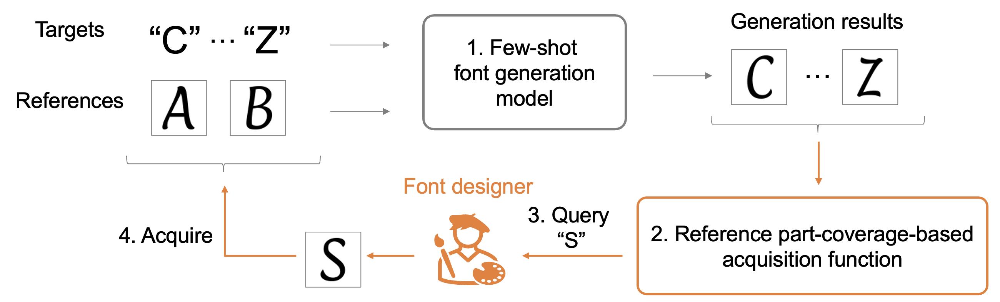

# Active Reference Acquisition in Few-Shot Font Generation [S.Matsuo+, ICDAR2026]
Shinnosuke Matsuo

> Few-shot font generation aims to synthesize the remaining glyphs of a font given one or a few reference glyphs while preserving stylistic consistency, thereby supporting font designers in efficiently completing a typeface. Existing methods primarily focus on improving generation quality given a fixed reference set. However, when the current reference glyphs are insufficient to represent the target style, few-shot font generation may fail to produce satisfactory results. In practical scenarios, additional reference glyphs can often be obtained from the designer when necessary. Accordingly, we propose a new framework, \emph{Active Reference Acquisition in Few-Shot Font Generation}, in which the model sequentially decides which character to acquire next as an additional reference. Furthermore, we propose a reference part-coverage-based acquisition function to efficiently query the designer. Motivated by the observation that font styles are well characterized by local structural parts, we represent each glyph using a histogram of local features and select query characters that maximize the expected part coverage of the reference set. By prioritizing characters that contain parts not yet covered by the current references, the proposed method progressively expands the diversity of visual parts in the reference set. As a result, generation quality is improved with fewer queries. Experiments on the Google Fonts dataset demonstrate that the proposed method achieves higher generation quality than random querying and reference-agnostic baselines.

## Code
The code and instructions are currently being prepared. We will release them soon.